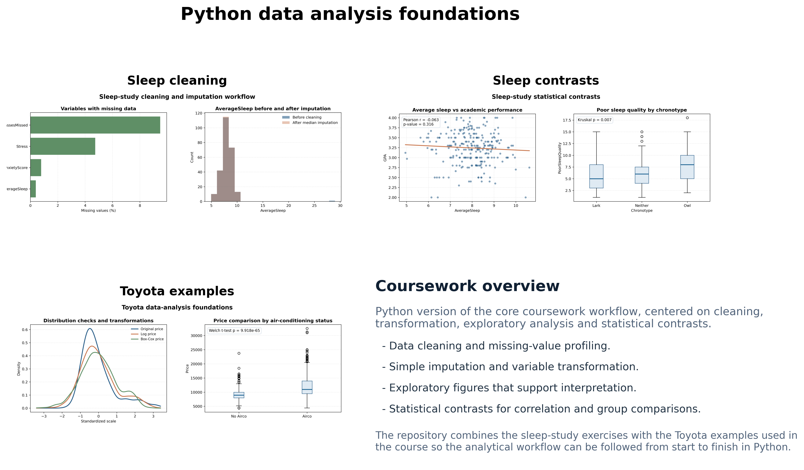

# Python Data Analysis Foundations

In this repository I reworked a first-semester data-analysis coursework block that I originally developed in R.

I keep this repository intentionally lightweight in the public portfolio: it documents the kind of work I carried out in the course without trying to turn introductory material into a flagship project. The focus is on the fundamentals that matter in real analysis workflows:

- loading and cleaning tabular datasets;
- identifying and correcting problematic values;
- simple missing-data handling;
- variable transformation;
- exploratory plotting;
- basic statistical contrasts and result interpretation.

## Scope

I build the repository around two case studies:

1. `Sleep-study workflow`
   - data review;
   - missing-value inspection;
   - simple imputation;
   - exploratory plots;
   - correlation and group-comparison tests.
2. `Toyota pricing examples`
   - variable preparation;
   - outlier handling;
   - transformation checks;
   - distribution plots;
   - hypothesis testing with a categorical factor.

The original coursework was written in R Markdown. Here I present the same analytical flow in Python so it sits naturally alongside the rest of the portfolio.

## Repository structure

- `src/sleep_study_translation.py`
  Python translation of the main cleaning, imputation and statistical checks used in the sleep-study coursework.
- `src/toyota_foundations_examples.py`
  Python version of the introductory Toyota-based exercises on data preparation, transformations and contrasts.
- `src/build_summary_panel.py`
  Utility that combines the main figures into a compact portfolio panel.
- `figures/`
  Curated output figures used in the README and on the portfolio website.
- `docs/project_notes.md`
  Notes on the translated workflow and repository decisions.
- `notebooks/README.md`
  Suggested notebook-style reading order for the translated material.

## Visual summary



## Main takeaways

- the sleep-study case shows how a compact workflow can move from cleaning and imputation into interpretable statistical testing;
- the Toyota case gives a clean example of variable transformation, exploratory plotting and a simple group-comparison contrast;
- I keep the code readable and reproducible without shipping the original local coursework data files.

## How to regenerate the public figures

I do not include the original coursework datasets here. To regenerate the figures locally, provide the paths through environment variables:

- `SLEEP_STUDY_SOURCE`
- `TOYOTA_SOURCE`

Then run:

```bash
python src/sleep_study_translation.py
python src/toyota_foundations_examples.py
python src/build_summary_panel.py
```

## Data availability

I do not redistribute the original source files used in the course here. Instead, I keep:

- the translated Python code;
- public-safe figures;
- project notes.

## Why this repository is included

This is not one of the headline portfolio pieces. I include it to show a solid base in practical data analysis: cleaning, transformation, imputation, exploratory plots and statistical reasoning.
